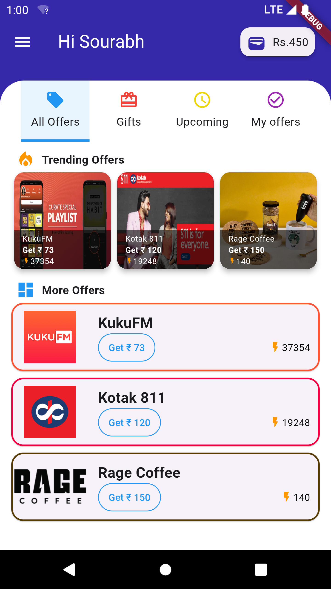
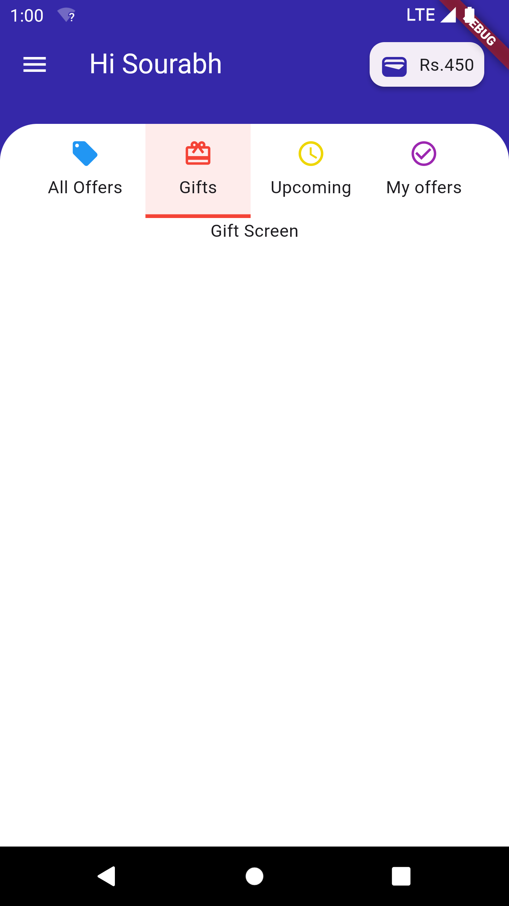
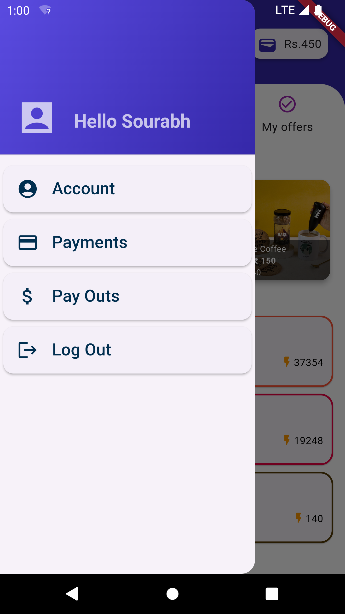

# Flutter Project

Welcome to my Flutter project! The UI is create only as the given screenshot and all the features and buttons are same as the instructions .This project follows a proper project structure and utilizes media queries for responsiveness. The data handling approach is optimized for low data volume, where all data is used multiple times without filtering. The filtering functionality is included but commented out for reference.

## Project Structure

The project follows a structured architecture to maintain clarity and scalability. 

## Responsiveness

The app is designed to adapt to various screen sizes using media queries, ensuring a consistent user experience across different devices.

## Data Handling

To optimize performance with low data volume, all available data is utilized directly without filtering. However, the filtering functionality is implemented but commented out in the codebase for future reference or scalability.

## Sample Image

Here's a sample image of the project:

Feel free to explore the codebase and reach out if you have any questions or suggestions!
